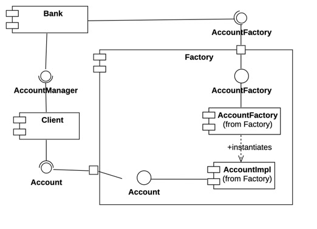
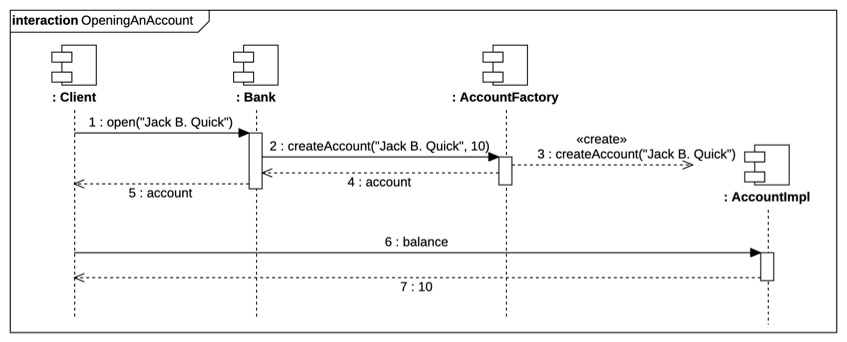

# bank_example_rmi
This piece of code implements a toy system organized in three cooperating executable components, AccountFactory, AccountManager and Client. A Client interacts with an AccountManager to open a back account. In turn, the AccountManager relies on a set of AccountFactory components to instantiate an Account for the client.  The Client then can interact directly with the instantiated Account to receive the account balance.
Account, AccountFactory and AccountManager instances are all remote objects that can be reached through RMI (Remote Method Invocation).

The following UML diagrams provide a description of the code from multiple perspectives.
This class diagrams shows the classes and the interfaces that compose the code and the relationships that can be inferred from the code itself.

This component diagram shows the components that should be instantiated and connected and are visible at runtime. From here we can infer that the two remote objects Account and AccountFactory belong to the same component that is exposing both their remote interfaces.

The following sequence diagram is providing an overview of the runtime behavior of our components:

Finally, the following deployment diagram maps each component on some concrete resources (desktop machines and generic nodes that can be, for instance, phisical servers or virtual machines). This diagram highlights also that the intermediate component, the Bank, can rely on multiple Factories.

The information conveyed by the diagrams can be derived directly from the code... but can't we understand this system better from the diagrams than from the actual implementation?   
